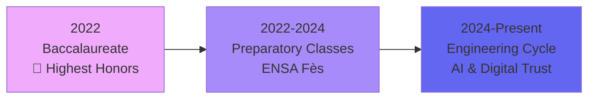

## Hi there 👋

<div align="center">

# ✨ Hi, I'm Aya YOUSSFI ✨

### 🤖 AI Engineer | 🔐 Digital Trust Enthusiast | 💡 Innovation Driver

[](https://git.io/typing-svg)

</div>

---

<div align="center">

### 🌐 Connect With Me

[](mailto:aya.youssfi@usmba.ac.ma)
[](#)
[](#)

</div>

---

## 🎯 About Me

> *Engineering student passionate about AI, Digital Trust, and creating meaningful technological solutions*

```python
class AyaYoussfi:
    def __init__(self):
        self.role = "AI Engineering Student"
        self.university = "ENSA Fès"
        self.specialization = ["Artificial Intelligence", "Digital Trust"]
        self.location = "Fes, Morocco"
        
    def current_focus(self):
        return {
            "learning": ["RAG Systems", "Neural Networks", "Semantic Search"],
            "building": ["AI Automation Tools", "ML Pipelines", "Smart Solutions"],
            "exploring": ["NLP", "Computer Vision", "Cybersecurity"]
        }
    
    def life_motto(self):
        return "Transform complexity into clarity, data into decisions 🚀"
```

---

## 💼 Professional Experience

### 🏢 ALTEN Delivery Center Morocco
**AI Engineering Intern** | *Jul 2025 - Aug 2025*

🎯 **Project GIRA** - Full RAG Pipeline Implementation

```
✓ Built complete RAG pipeline: chunking → embeddings → semantic search
✓ Developed Python + Flask interface for natural language queries
✓ Integrated contextual Q&A across multiple document sources
✓ Evaluated performance: Precision@k, Recall@k metrics
✓ Impact: Dramatically improved document retrieval speed & accuracy
```

---

## 🎓 Education Journey



🎓 **Engineering Cycle** | Computer Science, AI & Digital Trust — *ENSA Fès* (2024-Present)  
📚 **Integrated Preparatory Classes** — *ENSA Fès* (2022-2024)  
🏆 **Baccalaureate in Physical Sciences** — *Highest Honors* (2022)

---

## 🚀 Featured Projects

<table>
<tr>
<td width="50%">

### 🤖 AI Chatbot
*Contextual Q&A System*


- Embeddings & semantic search
- Natural language processing
- Real-time contextual responses

</td>
<td width="50%">

### 👓 Smart Belt for Visually Impaired
*IoT Accessibility Solution*


- Ultrasonic obstacle detection
- GPS navigation integration
- Real-time processing

</td>
</tr>
<tr>
<td width="50%">

### 🚗 Vehicle Management ML System
*Predictive Analytics*


- Availability forecasting
- Schedule optimization
- scikit-learn models

</td>
<td width="50%">

### 🔍 Fraud Detection Pipeline
*Anomaly Detection System*


- Transactional data analysis
- ML-based anomaly detection
- Real-time fraud prevention

</td>
</tr>
</table>

---

## 🛠️ Tech Stack

<div align="center">

### 💻 Programming Languages


### 🤖 AI & Machine Learning


### 🔧 Frameworks & Tools


### 🗄️ Databases


</div>

---

## 📊 Expertise Areas

<div align="center">

| AI & Data Science | Development | Languages |
|:---:|:---:|:---:|
| 🧠 Machine Learning | ⚡ Flask | 🇲🇦 Arabic (Native) |
| 🔮 Neural Networks | 📊 Data Visualization | 🇫🇷 French (C1) |
| 🔍 RAG Systems | 🎨 Frontend Development | 🇬🇧 English (C2) |
| 📝 NLP | 🔧 Backend Systems | |
| 🎯 Semantic Search | 💾 Database Design | |
| 📐 Embeddings | 🐛 Debugging & Testing | |

</div>

---

## 🏆 Certifications & Achievements

<table>
<tr>
<td width="50%">

### 🛡️ Cisco - Cyber Threat Management
*Sep 2025*
- Cybersecurity governance
- Risk management
- Threat identification
- Incident response planning

</td>
<td width="50%">

### 🌐 Cisco - Network Technician
*Jan 2025*
- Network configuration
- Troubleshooting
- Enterprise maintenance

</td>
</tr>
<tr>
<td width="50%">

### 🏭 UM6P - Industrial IoT
*Dec 2024*
- Real-Time Data Processing
- Microservices Architecture
- Python for IIoT & ML

</td>
<td width="50%">

### ☁️ Oracle - Cloud Infrastructure AI
*Aug 2024*
- OCI fundamentals
- Cloud Computing
- AI applications

</td>
</tr>
</table>

---

## 💪 Soft Skills

<div align="center">

```
🧩 Analytical Thinking  |  👑 Leadership  |  🤝 Collaboration
🔄 Adaptability  |  🎯 Problem Solving  |  💡 Innovation
```

</div>

---

## 📈 GitHub Stats

<div align="center">


</div>

---

## 🌟 Current Focus

<div align="center">

```ascii
┌─────────────────────────────────────────┐
│  🎯 Learning RAG Systems & LLMs         │
│  🔬 Exploring Advanced NLP Techniques   │
│  🛡️ Deepening Cybersecurity Knowledge  │
│  🚀 Building AI-Powered Solutions       │
│  📚 Contributing to Open Source         │
└─────────────────────────────────────────┘
```

</div>

---

## 💭 Philosophy

<div align="center">

> *"The best way to predict the future is to create it with AI"*

### Let's build something amazing together! 🚀

[](https://github.com/YOUR_GITHUB_USERNAME)

</div>

---

<div align="center">

### ⭐ From [Aya YOUSSFI](https://github.com/YOUR_GITHUB_USERNAME) with 💜

*Made with passion, powered by innovation*

</div>
